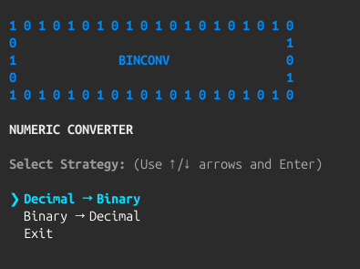
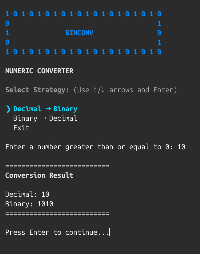
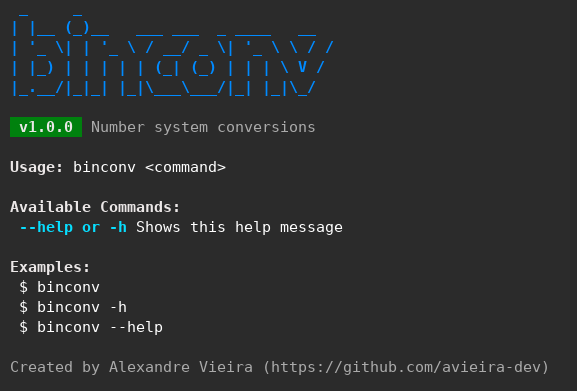

<div align="center">
    <h1>binconv</h1>
    <p>A lightweight command-line tool for number system conversions.</p>
    <p>
        
        
        
        
        
        
        
    </p>
</div>

---

## Overview

**binconv** is a lightweight CLI utility designed to convert numbers between different numeral systems, currently supporting decimal and binary conversions.

> [!IMPORTANT]  
> **binconv v1.0.0** is now stable.

---

## Table of Contents

- [Showcase](#showcase)
- [Roadmap](#roadmap)
- [Build and Execute](#build-and-execute)
- [Project Structure](#project-structure)
- [Philosophy](#philosophy)
- [Author](#author)
- [License](#license)

---

## Showcase

<p align="center">
    <em>Interactive menu option selection</em><br>
    <br><br>
    <em>Decimal to binary conversion</em><br>
    <br><br>
    <em>Help and available commands</em><br>
    
</p>

---

## Roadmap

| Feature                        | Status                      |
|--------------------------------|-----------------------------|
| Decimal → Binary conversion    | ████████████████████ `100%` |
| Binary → Decimal conversion    | ████████████████████ `100%` |
| Hexadecimal support            | ░░░░░░░░░░░░░░░░░░░░ `0%`   |
| Octal support                  | ░░░░░░░░░░░░░░░░░░░░ `0%`   |

---

## Build and Execute

```bash
mkdir build && cd build
cmake .. && cmake --build .
./binconv
```

--- 

## Project Structure

```text
binconv/
├── build/
├── include/
│   └── binconv/
│       ├── application.h
│       ├── banner.h
│       ├── colors.h
│       ├── convert.h
│       ├── help.h
│       ├── input.h
│       ├── menu.h
│       ├── signal.h
│       └── terminal.h
├── src/
│   ├── application.c
│   ├── banner.c
│   ├── convert.c
│   ├── help.c
│   ├── input.c
│   ├── main.c
│   ├── menu.c
│   ├── signal.c
│   └── terminal.c
├── .gitignore
├── CMakeLists.txt
├── LICENSE
└── README.md
```

---

## Philosophy

This project prioritizes:

- Low-level understanding of number systems
- Minimal external dependencies
- Clear separation between input handling and conversion logic
- Safe input processing
- Modular architecture
- Incremental feature expansion

---

## Author

**Alexandre Vieira**  
GitHub: [@avieira-dev](https://github.com/avieira-dev)

---

## License

Distributed under the [MIT License](LICENSE). See `LICENSE` for details.